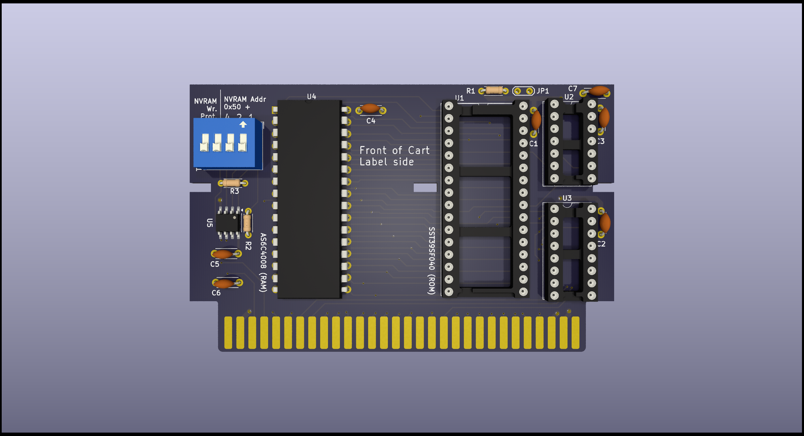
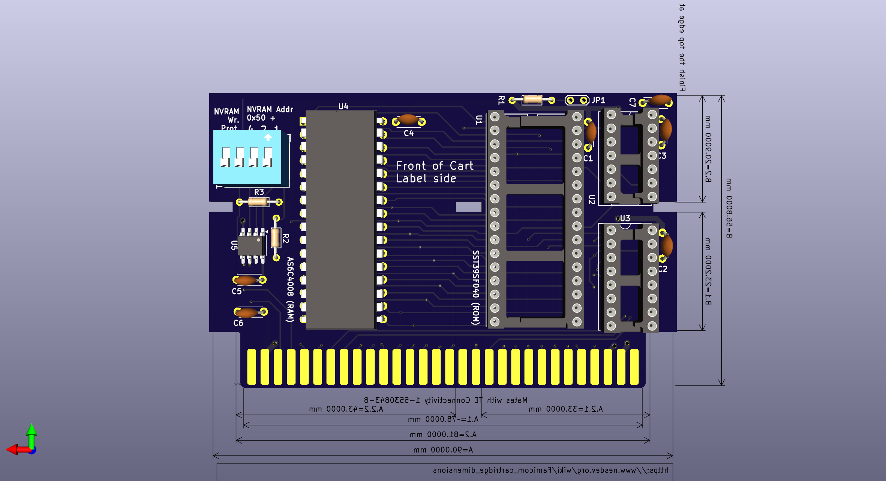

# Commander X16 Cartridges

## Overview

These are just prototype/practice designs for making a simple cartridge
for the Commander X16. They have not yet been tested on a real X16.

X16 Expansion and Cartridge footprints are available from:

https://github.com/jkominek/x16expansion

As a primer, cartridges can support up to 3.5MB of memory which can be a mix of RAM or ROM.
As an extension of the X16 ROM space, memory is divided into 16kb pages, 32 of which would
fit onto each memory chip. This assumes 8-bit 512k (4Mbit) memory chips are used.

Cartridges can also have I2C flash memory (for saving game states), and can use 
memory-mapped IO (MMIO) though it is *highly* recommended to use the `IO7`
address range as cartridges have been given priority to this range over expansion cards.

Be aware that the "front" of the cartridge (the side which would have a typical label) is actually 
the back relative to a typical expansion card. This was done so that X16's which have a side cartridge 
slot can have the cartridge label side up. Cartridges and expansion cards use the same slots.

For more information, consult the x16-docs. 

## Chip Locations

Unless otherwise indicated, all cartridges are meant for booting directly from the cartridge.
This means the first chip (the one which is for ROM banks 32-63) will be a 512k ROM. Developers
that want their program to actually boot from ROM still need to setup the ROM image correctly.

For more information, consult the x16-docs.

## Cartridge Options

### Simple Cart

A no frills simple cartridge with a single ROM (512kb) and discrete decode logic that is inherited 
from the X16 Developer edition. This borrows some layout concepts from ROAM as made by Wavicle.
Big thanks to him for these contributions.

### ROAM (ROM + RAM)

Similar to the above but includes space for an SRAM chip (get it? ROM + RAM = ROAM) as well as an I2C NVRAM chip. 

The ROM is available in banks 32-63 and the RAM in banks 64-95. The banks can be 
swapped by cutting jumpers `JP3` and `JP4` and placing solder bridges over `JP2` and `JP5`.
That would place the RAM in banks 32-63 which can be beneficial when testing cartridge code.
The RAM can be loaded with cartridge data and then the X16 can be rebooted (leaving the 
data in place) which should boot off the RAM as if it were ROM.

The I2C NVRAM can store up to 8k (if using the chip provided in the BOM or one similar)
and can be useful for storing save data.

Huge thanks to Joe Burks (Wavicle) for handling a majority of the routing which has made for a 
gorgeous PCB layout and one that is also fairly easy to understand. Likewise he came up with
the solder-jumper options as well as the I2C additions and layout.

## Decode Explanation

The logic sections are derived fairly heavily from the X16 Dev 1.0 schematic.

`ROMB7-ROMB0` can be thought of as the ROM address lines. These are decoded from the
ROMBANK zeropage bank value (`$01`) by the X16 itself and are presented along the cartridge
connector.

We can take this 8-bit number and carve it up into chip select lines, which are `ROMB7-ROMB5`;
and additional address lines for the RAM/ROM chips, which as `ROMB4-ROMB0`.

Since each RAM/ROM has 512k of 8-bit memory, it means we can have up to 8 512k chips. 
The first chip is the System ROM for X16 (it is for banks 0-31) which means the rest
are available to cartridges.

| Banks (Decimal) | Banks (Hex) | ROMB7-ROMB5 (Binary) | Chip              |
| --------------- | ----------- | -------------------- | ----------------- |
| 00-31           | $00-1F      | 000                  | 0 (System ROM)    |
| 32-63           | $20-3F      | 001                  | 1 (Cart Boot ROM) | 
| 64-95           | $40-5F      | 010                  | 2                 |
| 96-127          | $60-7F      | 011                  | 3                 |
| 128-159         | $80-9F      | 100                  | 3                 | 
| 160-191         | $A0-BF      | 101                  | 3                 | 
| 192-223         | $C0-DF      | 110                  | 3                 | 
| 224-256         | $E0-FF      | 111                  | 3                 | 

### 74HCT138

This is known as a demux. It takes as input 3 signals (A0-A2) which represent 
numerical values 0-7 and enables only one of the output pins. These are used
as chip selects by taking the top 3 bits (`ROMB7-ROMB5` as noted above) as 
inputs for the demux.

Note that the System ROM is on the mainboard so the first output of the 138 
should not be used.

The outputs each go to the chip-select of a specific RAM or ROM to enable
that particular chip for the given bank range.

### 74HCT00

This is a 4 gate NAND IC. This is used to invert signals and provide a logical AND
function at the same time. For the cartridges it performs 3 functions:

#### ROM Enable

Not to be confused with chip-select, this ends up being the enable input to the 74HCT138
so that the outputs are enabled only when the X16 is reading or writing from the ROM
address space (`$C000-$FFFF`). In binary this is
`1100 0000 0000 0000 - 1111 1111 1111 1111`. That means the 2 topmost address lines 
(`A15-A14`) can be used as inputs to one of the NAND gates. Since the 74HCT138 uses
active-low (inverted) inputs, we provide this output to both the E0 and E1 pins 
of the 74HCT138.

#### PHI2 / RWB

In this context, `PHI2` can be thought of as the system clock. `RWB` tell us if the 
CPU is doing a read or a write. We combine these together because `RWB` alone could result
in inconsistent read or writes because the 6502 does "work" outside of `PHI2`. It can be
roughly compared to modern DDR memory, where action happens on both the rising and falling
edges of a clock. We only care about the rising edge here.

So when PHI2 is high, a read or write may be taking place. To figure out which, `RWB` is used.
3 gates of the 74HCT00 are used to essentially provide a Write-Enable or Read-Enable line, 
noting that these are active low.

### Chip Address Lines

Because we are using 4Mbit RAM/ROM chips which are divided into 512k 8-bit bytes, each chip
has 19 address lines (`A18-A0`). 2^19 is 512k. The first 14 address lines (`A13-A0`) form
the lower address. Of note 2^14 is 16k which just so happens to be the bank page size.
The top addresses (`A18-A14`) are formed from the bottom 5 bits of the `ROMB` address space.
2^5 is 32, which is how many pages each chip can support.

As noted above, the top `ROMB` bits are used for chip selects and thus each ROM does not 
actually see those. Using bigger or smaller RAM or ROM chips would change how this works.
